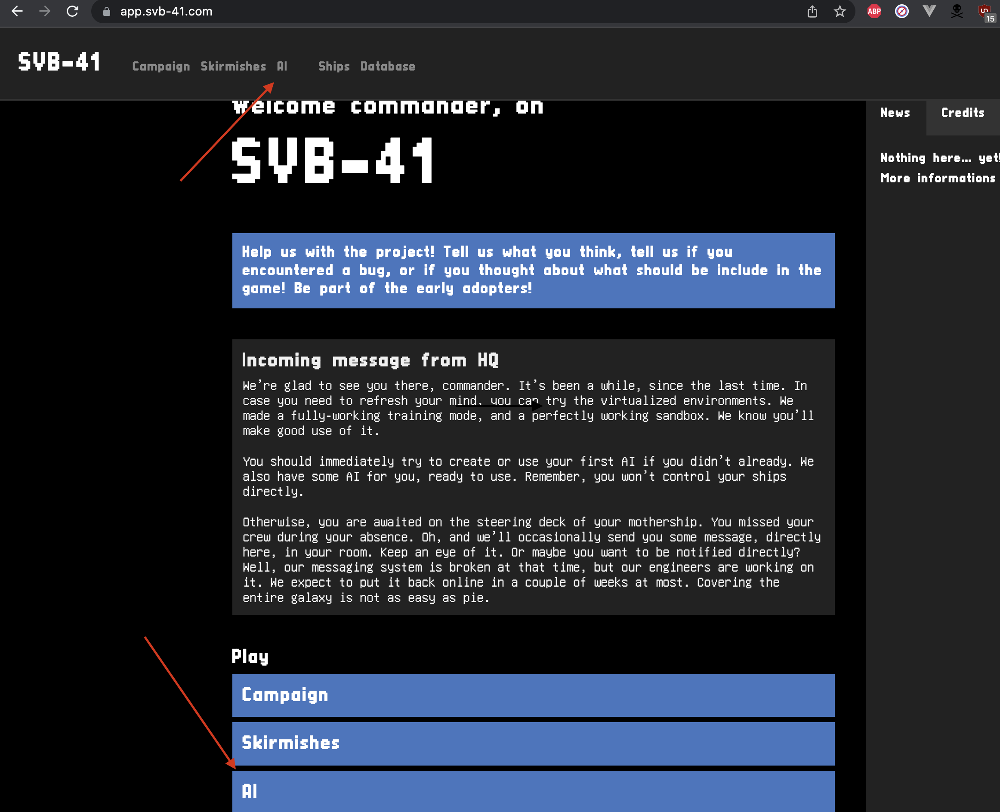

# Anet TME

L'objectif de ce TME est d'implémenter des automates à partir de grafcet.

Dans une première partie vous allez devoir écrire les grafcet suivant les scénarios donnés puis les implémenter dans le simulateur.

## Scénarios

#### Tourner

Tourner jusqu'à un angle de 35 degrés.

#### Avancer

Avancer tout droit de 200 unités de distance.

#### Aller à

Se déplacer jusqu'à une position situé à (300, 200) de notre position.

(En coordonnées cartésienne (x,y) cela correspond donc un point situé 300 devant et 200 à gauche de notre position initiale)

#### Utiliser le radar

Attendre qu'un élément rentre dans le radar et se tourner vers l'élément.

#### Rester hors de portée

Accélérer jusqu'à atteindre une vitesse de 0.1.
Lorsque que quelque chose rentre de le radar s'arrêter.

#### Sentinelle

Attendre qu'un élément rentre dans le radar et se tourner vers l'élément.
Quand l'élément est en face de nous tirer.

#### Assaut

Accélérer jusqu'à atteindre une vitesse de 0.1.
Quand élément rentre de le radar se tourner vers l'élément.
Quand l'élément est en face tirer.

### Détails sur le système

#### Actions disponibles :

- Accélérer(x: float)
- Ralentir(x: float)
- TournerDroite(x: float)
- TournerGauche(x: float)
- Tourner(x: float)
- Tirer()

#### Capteurs disponibles :

- position: (x: float, y: float, direction: float)
- vitesse: (x: float)
- radar: (x: float, y: float, vitesse: float)[]

Notre vaisseau peut accélérer et ralentir, comme c'est un vaisseau spatial, il n'y a pas de frottement donc quand le vaisseau à accéléré il garde sa vitesse.

Le vaisseau avance toujours devant lui (quand il a une vitesse positive). Quand le vaisseau tourne sa direction change.
Les fonctions tourner prennent un flottant en argument, il s'agit d'un angle en radian. (si l'angle est négative alors le vaisseau tourne dans l'autre sens).

## Le simulateur

Une fois vos grafcet écrit vous devez les implémenter.

Pour ça aller sur l'URL : https://app.svb-41.com/


Créé un nouveau controller dans la page AI.

```ts
import * as svb from "@svb-41/core";

type Data = { pos?: svb.ship.Position };

export const data: Data = {};
export const ai: svb.AI<Data> = ({ stats, radar, ship, memory }) => {
  if (!memory.pos) memory.pos = stats.position;
  const near = svb.radar.nearestEnemy(radar, stats.team, stats.position);
  if (near) {
    const source = stats.position;
    const target = near.enemy.position;
    return svb.geometry.aim({ ship, source, target, threshold: 0.01 });
  }
  if (Math.abs(stats.position.direction - memory.pos.direction) > 0.1)
    return ship.turn(stats.position.direction - memory.pos.direction);
  if (stats.position.speed < 0.8) return ship.thrust();
  return ship.idle();
};
```

Lancer la première mission: Campaign -> 1
Et vérifier que tout fonctionne correctement.

Maintenant implémentez chacun des scénarios dans des controllers et testez les sur la mission 1 ou 2.
(la mission 2 est plus pratique car les vaisseaux ennemis restent statique)

### Documentation du vaisseau

Une documentation est disponible sur le site : https://app.svb-41.com/database

#### Fonctions et notions utiles

Pour modifier le comportement du vaisseau il faut modifier le contenu de la fonction `ai`.
Cette fonction à besoin de retourner un instruction pour être valide.

Les instructions :

- `ship.idle()` ne rien faire
- `ship.turnLeft()` tourner à gauche
- `ship.turnRight()` tourner à droite
- `ship.thrust()` accélérer
- `ship.thrust(-1)` ralentir
- `ship.fire()` tirer

Vous pouvez aussi trouver des informations sur le vaisseau dans `stats`

Plus particulièrement dans `stats.position`

Pour trouver vos erreurs il peut être intéressant d'afficher vos variables.
Pour ça vous pouvez utiliser `svb.console.log()` pour pouvoir les lire directement dans le navigateur.
