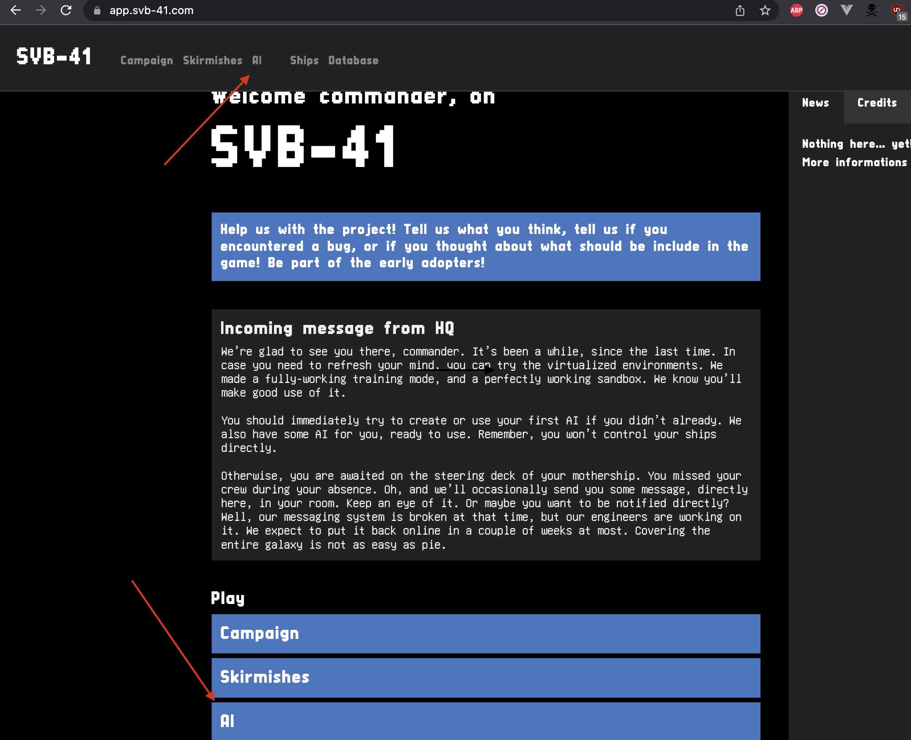

# Anet TME

In this lesson you have to write grafcet and the implement its in a simulation.

Firstly you have to wite grafcet from the following scenario and then use the simulation to test it.

## Scenarios

#### Turn

Turn to 35 degrees.

#### Go forward

Go straight for 200 distance unit.

#### Go to

Move to a position at (300, 200) from your initial position.

(In cartesian coordonate (x,y) refer to a point at 300 forward and 200 left from your initial position)

#### Use radar

Wait that something enter your radar range et turn to face it.

#### Stay out of range

Speed up until a speed of 0.1.
When something entre your radar range stop and wait.

#### Sentinelle

Wait that something enter your radar range et turn to face it.
When this thing is in front of you open fire.

#### Assaut

Speed up until a speed of 0.1.
Wait that something enter your radar range et turn to face it.
When this thing is in front of you open fire.

### System informations

#### Actions available :

- Accelerate(x: float)
- SlowDown(x: float)
- TurnRight(x: float)
- TurnLeft(x: float)
- Turn(x: float)
- Fire()

#### Captor available :

- position: (x: float, y: float, direction: float)
- speed: (x: float)
- radar: (x: float, y: float, speed: float)[]

The ship can accelerate and slow down.
We are in space so there is no friction.
When the ship speed up it keep its speed.

The ship always go forward (when it have speed).
When it turn it direction change.
The turn functions take a float argument, it is a radian angle. (If it's negative the ship turn in the other side).

## Simulator

When you have done a grafcet you have to implement it.
https://app.svb-41.com/




Create a new controller in the AI page.
Use the code below.

```ts
import * as svb from "@svb-41/core";

type Data = { pos?: svb.ship.Position };

export const data: Data = {};
export const ai: svb.AI<Data> = ({ stats, radar, ship, memory }) => {
  if (!memory.pos) memory.pos = stats.position;
  const near = svb.radar.nearestEnemy(radar, stats.team, stats.position);
  if (near) {
    const source = stats.position;
    const target = near.enemy.position;
    return svb.geometry.aim({ ship, source, target, threshold: 0.01 });
  }
  if (Math.abs(stats.position.direction - memory.pos.direction) > 0.1)
    return ship.turn(stats.position.direction - memory.pos.direction);
  if (stats.position.speed < 0.8) return ship.thrust();
  return ship.idle();
};
```

Start the first mission in campaign.
Be sure that everything is working.

Now implement each scenario in controllers and test it in mission 1 or 2.
(mission 2 have static opponent)

### Ship documentation

There is a documentaion available on the website : https://app.svb-41.com/database

#### Some functions and useful ideas

To change the ship behaviour you have to change the body of the `ai` function.
This function must return an instruction.

Instructions :

- `ship.idle()` do nothing
- `ship.turnLeft()` turn left
- `ship.turnRight()` turn right
- `ship.thrust()` speed up
- `ship.thrust(-1)` slow down
- `ship.fire()` shoot forward

You can also find some useful informations about the ship in `stats`

More precisely in `stats.position`

To debug it can be useful to print things.
You can use `svb.console.log("hello")` to print directly in the browser.
